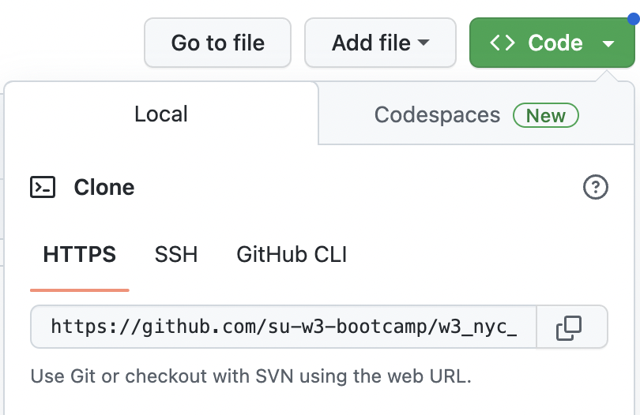
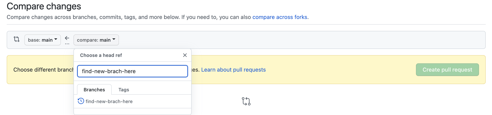

# W3Schools Web Development Deliverables

A dedicated space for students of C3 - SF to be able to deliver assignments using Github.

---

## Why Github?

GitHub is a common tool used in programming all over the world. It is a way to help you manage different versions of your code and collaborate with other developers. Building projects is one of the core parts of being a developer.

While there are many commands and uses of Github beyond what this repository will be used for, this is a great way for us to use an industry-standard tool to deliver assignments whilst familiarizing ourselves with tools and practices surrounding code delivery and collaboration.

---

## Getting Started

This section will contain a set of instructions to get the repository cloned to your machine locally.

### A double check

Firstly, you will notice that there is a directory available for you within this repository. If you find that a directory does not exist with your name, please let your instructor know to create one for you.

### Installing git

In order to be able to clone your repository locally and commit changes to it, you'll need to first get access to git on your machine.

Instructions for installing git on your machine can be found [here](https://github.com/git-guides/install-git).

### Cloning your repository

In order to be able to work with this repository, you will need to clone it to your personal computer first. To do that, you will need to:

1. Copy the git path of the repository by clicking on the "Code" dropdown button and copying the text in the dropdown under the "HTTPS" tab



2. Open a terminal window

- On a Mac, you should be able to click on `Cmd` + `Shift`. Then type "Terminal" and click on the first option to open the terminal
- On Windows, Open your menu > search for "Command Prompt" in your menu search bar, and select the "Command Prompt" option. This is your terminal on Windows.

3. Now let's navigate to where you want to store your repositories and projects.

- Let's assume you want to create a directory in your `Documents` folder called `w3bootcamp` and work off that folder for all your repositories. To do that, follow the following steps:

  1. Navigate to the `Documents` folder by running the following in your terminal

  ```
  cd ~/Documents
  ```

  2. Create a new directory in the `Documents` folder called `w3bootcamp`

  ```
  mkdir w3bootcamp
  ```

  3. Navigate into your new folder

  ```
  cd w3bootcamp
  ```

  4. Clone the repository locally into this folder

  ```
  git clone <<PASTE REPOSITORY GIT PATH HERE>>
  ```

  5. Check that a new repository has been created for your deliverables

  ```
  ls
  ```

---

## How do I submit my assignments?

In order to submit our assignements, will need to follow a few main steps:

1. Create a branch

   Branches are a copied version of your code which you will get to work on without potentially causing any disruptions to someone else's code before you're ready to share it with everyone else.

   Imagine a google doc that several people are working on where someone working up top shifts your work or overrides what you're doing. This allows users to work in silos until they're ready to share or `merge` their code to the base branch.

   [Learn more here](https://www.w3schools.com/git/git_branch.asp?remote=github).

2. Make changes to your branch

3. Create a pull request to merge your changes into a base branch. This step could involve requesting approvals from your team members.

4. Merge your changes into the base branch.

### Creating a branch

To create a branch, you will want to do the following.

1. Set your local code to be that of the base branch you want to branch off. Let's assume this is the `main` branch

```
git checkout main
```

2. Ensure that you're about to work off the most up to date version of the `main` branch

```
git pull origin main
```

3. Create a new branch. Let's assume it's assignment 1 and it has to do with html. Let's call this new branch `<<my name>>-assignment1-html` where `<<my name>>` is replaced with your actual name

```
git checkout -b "<<my name>>-assignment1-html"
```

### Make changes in your code

1. Create a folder within your directory for your assignment

- Navigate to your directory

```
cd <<name of your directory (it should be your name)>>
```

- Create the folder. Let's call this one `assignment1-html`

```
mkdir assignment1-html
```

2. Add your code to this new folder.

3. Stage and commit your changes with a commit message.

```
git add .
git commit -m "submitting assignment 1"
```

4. Push your changes up to be accessed via Github. Pro tip: you would normally have to specify which branch you're pushing to but using the keyword `HEAD` indicates that you're pushing to the current branch you're in.

```
git push origin HEAD
```

### Create a pull request (PR)

1. Go back to your Github repository in your browser and navigate to the "Pull Requests" tab


2. Click on "New pull request"

3. Ensure that the base branch is set to `main` and the compare branch is your new branch name



4. Click on "Create pull request"

5. Your instructor should get a notification about this pull request, but just let them know anyway via Slack.

---

### I created a pull request, now what?

Your instuctor can use this pull request to leave feedback for you by leaving inline comments or comments on your entire pull request (PR). Your instructor could also use this as a medium to request for more changes prior to approving your PR.

Once your instructor approves your PR, your instructor will merge the PR back to the base branch selected in the PR (`main`).

---

### A bunch of us merged our changes. How can I see the new code?

1. Navigate back to the `main` branch

```
git checkout main
```

2. Pull your changes

```
git pull origin HEAD
```

You will now have all the latest changes!
